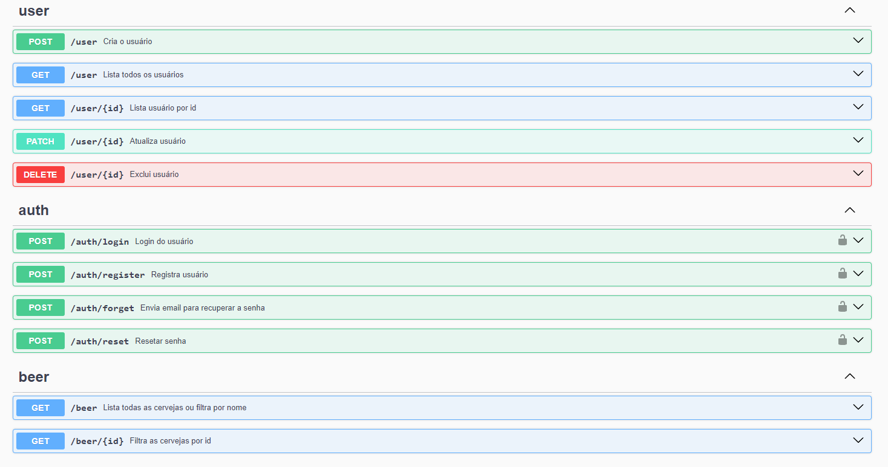

<p align="center">
  <a href="http://nestjs.com/" target="blank"></a>
</p>

[circleci-image]: https://img.shields.io/circleci/build/github/nestjs/nest/master?token=abc123def456
[circleci-url]: https://circleci.com/gh/nestjs/nest

## Descrição

Esta API foi construído com o framework [Nest](https://github.com/nestjs/nest). A escolha do framework foi baseada em no fato de que, entre outras coisas, ele é bem completo, possui arquitetura modular e organizada e permite a documentação automática da API com o Swagger.

Neste projeto, o usuário pode se cadastrar, editar seus dados, realizar login, solicitar e-mail para recuperação de senha, recuperar senha através do token enviado para o email e criar um novo registro.

A autenticação da API foi construída utilizando [JWT](https://jwt.io/) e a definição das autorizações para o usuário foi feita utilizando o "Guard" do Nest.

Além disso, o usuário pode consultar a API [Punk API v2](https://punkapi.com/) e filtrar os resultados por nome ou id. A integração com a API externa foi feita utilizando [Axios](https://axios-http.com/ptbr/).

## Instalação

```bash
$ npm install
```

## Rodando o app

```bash
# development
$ npm run start

# watch mode
$ npm run dev

```

## Documentação

A API foi documentada com o Swagger onde é possível encontrar todas as rotas disponíveis acessando `http://localhost:3000/api`

Obs.: para verificação da rota `auth/forget` é necessário atualizar os dados do arquivo `.env.example` com os dados do servidor de email que será utilizado. Talvez seja necessária alguma configuração adicional dependendo do servidor utilizado. Para fins de teste, sugiro o uso de [Ethereal](https://ethereal.email/).



## Tecnologias utilizadas

[](https://skillicons.dev)

## Contato

- Autora - [Daiane Bolzan](https://www.linkedin.com/in/daiane-deponti-bolzan/)

## License

[MIT licensed](LICENSE).
